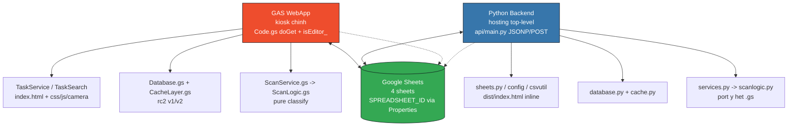
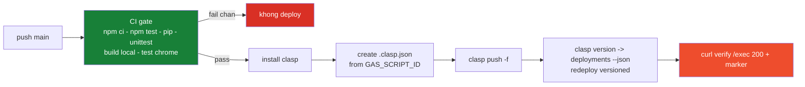

<p align="center">
  <a href="https://github.com/Duc-Nguyen-739/spx-diem-danh"></a>
  
  
  
</p>

<p align="center">
  
  
  
  
  
</p>

<p align="center">
  
</p>

<p align="center">
  <b>Repo:</b> <code>Duc-Nguyen-739/spx-diem-danh</code> &nbsp;•&nbsp; <b>Branch:</b> <code>main</code> &nbsp;•&nbsp; <b>Timezone:</b> <code>Asia/Ho_Chi_Minh</code><br/>
  <a href="docs/spec/2026-08-02-phase0-spec.md">📄 Spec Phase 0</a> &nbsp;•&nbsp;
  <a href="docs/intent/diem-danh-hn2-soc.md">🎯 Intent</a> &nbsp;•&nbsp;
  <a href="AGENTS.md">📜 AGENTS</a> &nbsp;•&nbsp;
  <a href="skills/project-skill/SKILL.md">🧠 Skill</a>
</p>

---

### 🧭 Mục lục

<p align="center">

`✨ Tính năng` • `🏗️ Kiến trúc` • `🧱 Tech Stack` • `📁 Cấu trúc` • `🗄️ Sheets` • `⚡ Bắt đầu nhanh` • `🧪 Kiểm thử` • `🚀 Deploy` • `📏 Quy ước`

</p>

---

## ✨ Tính năng — Bento hot 2026

<table>
<tr>
<td width="33%" valign="top">

#### 🎫 Tạo task
`reconcile` / `meal-move`
- Station · Ca · Team · Ngày · Loại HĐ
- 1 task = 1 tổ hợp lọc `StaffData`
- **meal-move 2 mốc** Ra/Vào + agency

</td>
<td width="33%" valign="top">

#### ⚡ Quét & đối chiếu
- `Ops…` case-insensitive → **Có mặt / Đã điểm danh / Dư / Ra ngoài**
- **Counters epoch** `timeScanEpoch`/`timeRaEpoch`
- **Queue 1ms** + optimistic, dedup 1.5s

</td>
<td width="33%" valign="top">

#### 📷 Camera AI
- **ZXing** (chính) + Quagga + jsQR
- Tesseract **OCR** + **Web Worker** 3-4 binarizer
- GAS **popup** · Standalone **live modal** — quét liên tục

</td>
</tr>
<tr>
<td width="33%" valign="top">

#### 🔍 Tìm kiếm
- Header search `Ops…` → hồ sơ + task đã điểm danh
- Bảng NV: search · filter status · sort cột

</td>
<td width="33%" valign="top">

#### 🎨 Trải nghiệm kiosk
- Scan **card projector** + **toast** (không `alert`)
- **beep/buzz** Web Audio 🔊/🔇 + `failure-alert-new.*.mp3`
- **Poll 3s** · loading overlay · focus trap

</td>
<td width="33%" valign="top">

#### ♿ A11y & polish
- Skip-link · `prefers-contrast` · badge nền đặc
- Chip filter · HUD dark industrial · Neon Shopee Express `#EE4D2D`
- Gradient `scanLine` + `stampIn` + glass overlay

</td>
</tr>
</table>

> **Kết thúc task** → dòng chưa quét gán **Vắng** (modal confirm) · có thể **mở lại** `reopenTask` · **Dư** linh hoạt — mã ngoài hệ thống vẫn ghi `Dư` không chặn luồng.

---

## 🏗️ Kiến trúc dual runtime — 1 logic, 2 nơi chạy

> Đổi logic quét/classify → sửa **cả `.gs` lẫn `api/*.py`** + chạy `npm test` + `npm run test:py` (§21 `AGENTS.md`)



<details>
<summary><b>📐 Luồng quét chi tiết (click mở)</b></summary>

```
scanStaffApi (Code.gs) → scanStaff (ScanService.gs) → classifyScan / classifyMealMoveScan (ScanLogic.gs pure)
  + readTaskCached_ / readLogRowsCached_ / appendLogRow_ / updateLogRowScan_ / updateLogRowRa_ (Database.gs)
  + readStaffIndex_ (lazy, chỉ khi NV lạ) + LockService.waitLock(10000) + releaseLock() finally
  + isValidBarcodeId() guard "Ops" + DUPLICATE_WINDOW_MS 1500ms ↔ CAM_CODE_COOLDOWN_MS
```

</details>

---

## 🧱 Tech Stack — neon badges

| Thành phần | Công nghệ | Ghi chú hot |
| :--------- | :-------- | :---------- |
| 🎨 **Frontend** |    | 3-file split `index.html` + `css.html` (`<style>`) + `js.html` (`<script>`) qua `<?!= include() ?>` |
| 📷 **Camera** |    | `camera-scan.html` + `camera-css.html` + `lib-jsqr/quagga` + **Web Worker 3-4 binarizer** + `contrast(1.35)` |
| ☁️ **Backend GAS** |  | `Code.gs` + 8 module `.gs` · `V8` · `Asia/Ho_Chi_Minh` · `USER_DEPLOYING` · `DOMAIN` |
| 🐍 **Backend Python** |   | `api/main.py` · `scanlogic.py` · `services.py` · `database.py` · `sheets.py` · `google-api-python-client` |
| 🗄️ **Database** |  | ID via **Script Properties** `SPREADSHEET_ID` — **không commit** (FIX-25) |
| 🧪 **Test** |   | `node:test` 27f/368 + `unittest` 85 + Chrome 11 = **464** |
| 🔧 **Build** |  | `inline-html.js` · `serve.js :4173` · `build-static.js → dist/` · `build-local.js → index.local.html` |
| 🚀 **Deploy** |   | `push -f` + `version` + `redeploy` (không `deploy` mới) |

---

## 📁 Cấu trúc dự án

<details>
<summary><b>🌳 Cây thư mục — click mở</b></summary>

```
spx-diem-danh/
├── appsscript.json        # manifest GAS — webapp block (USER_DEPLOYING, DOMAIN, V8, Asia/Ho_Chi_Minh)
├── .clasp.json            # scriptId + rootDir — GITIGNORE, không commit
├── .claspignore
├── Code.gs                # doGet (createTemplateFromFile+include) + gate isEditor_ + JSONP
├── Config.gs              # SHEETS/COLS/STATUS/TASK_STATUS/TASK_TYPE/CACHE_TTL/CACHE_KEYS/UI_LABELS
├── CsvUtil.gs             # parse/normalize CSV + isValidBarcodeId() (pure)
├── Database.gs            # StaffData index / task CRUD / log rows / cache 5m/15s/30s
├── CacheLayer.gs          # helper cache versioned rc2_*_v1/v2
├── ScanLogic.gs           # classifyScan / classifyMealMoveScan / computeCounters (pure, dual-runtime)
├── ScanService.gs         # scanStaff / pasteMealMoveScan — guard Ops + LockService + update/append
├── TaskService.gs         # createReconcile/MealMove + complete/reopen + markUnscannedAbsent_
├── TaskSearch.gs          # searchStaffApi — tìm Ops → profile + task đã điểm danh
├── JsonpApi.gs            # JSONP standalone (whitelist + cb /^[A-Za-z0-9_$.]+$/)
├── index.html             # UI: CHỈ HTML — scriptlet include('css'/'js'/'mobile'/'camera')
├── css.html               # toàn bộ CSS (inline lúc serve — GAS không serve .css tĩnh)
├── js.html                # toàn bộ client JS (marker TASK-MENU-*/PURE-LOGIC-*/SCAN-LOGIC/OCR-SCAN-*)
├── camera-scan.html       # chain decode ZXing→Quagga→jsQR + OCR + Worker
├── camera-css.html        # overlay CSS camera
├── lib-jsqr.html / lib-quagga.html  # vendored
├── mobile.html            # variant mobile
├── api/                   # backend Python (mirror GAS)
│   ├── main.py            # handler JSONP/POST (mirror JsonpApi.gs)
│   ├── scanlogic.py       # port ScanLogic.gs
│   ├── services.py        # port ScanService/TaskService
│   ├── database.py        # port Database.gs
│   ├── sheets.py / cache.py / config.py / csvutil.py
│   └── test_*.py          # 85 tests
├── mock/mock-google.js    # mock google.script.run + ?demo=1
├── scripts/
│   ├── serve.js           # preview :4173 (inline + inject __RC_STANDALONE__/__RC_DEMO__)
│   ├── build-static.js    # → dist/ (tự chứa)
│   ├── build-local.js     # → index.local.html (cho file:// + test:chrome)
│   ├── inline-html.js     # transform <?!= include() ?>
│   └── cdp-helper.js      # CDP list/open/eval/shot/click
├── tests/                 # 27 file, 368 tests — node:test
├── docs/intent/diem-danh-hn2-soc.md
├── docs/spec/2026-08-02-phase0-spec.md
├── skills/project-skill/ + review-gas-failure-modes/
├── .github/workflows/deploy.yml  # CI gate + push + redeploy
├── package.json           # v0.1.0 — test/test:py/test:chrome/dev/build/build:local
└── requirements.txt
```

> **3-file split (§20 AGENTS.md):** GAS `HtmlService` không serve `.css`/`.js` tĩnh (clasp chỉ push `.gs/.html/.json`) nên CSS/JS ở `css.html`/`js.html` và nhúng qua scriptlet `<?!= include('css') ?>`. `serve.js` + `build-static.js` thay bằng nội dung file qua `inline-html.js` — sửa transform phải sửa đủ 3 nơi + `npm test` (`inline-html.test.js`, `code-doget.test.js`).

</details>

---

## 🗄️ Schema Google Sheets

> **Bảo mật FIX-25:** `DEFAULT_SPREADSHEET_ID = ''` trong `Config.gs` — set ID thật vào **Script Properties** `SPREADSHEET_ID` (GAS → Project Settings → Properties) hoặc env Python. Không commit ID.

| Sheet | Vai trò | Cột | Cache |
| :---- | :------ | :-- | :---- |
| 🟦 **Config** | Cấu hình optional | `STATIONS`, `DEFAULT_STATION` | `5m` |
| 🟩 **StaffData** | Dữ liệu HR — **20 cột** giữ nguyên header `Att.csv` | `No., Staff ID, Staff Name, ..., Slot Code, Workstation, Team, Station` — read-only, HR tự đồng bộ | `STAFF_INDEX 5m` |
| 🟧 **AttendanceTask** | Task — **10 cột** | `Task ID, Type (reconcile/meal-move), Station, Slot Code, Team, Status (open/done), Created At/By, Completed At, Note` | `15–30s` |
| 🟨 **AttendanceLog** | Log đối chiếu — **13 cột** | `Task ID, Staff ID/Name, Slot/Team/Station/Workstation, Time Ref, Time Scan, Status (-/Có mặt/Vắng/Dư/Ra ngoài), Date, Time Ra, Agency` | `LOG_ROWS 30s` |

> Đã bỏ `cardIn`/`cardOut` khỏi Log (2026-08-03) — StaffData giữ nguyên, chỉ hiển thị.

<p align="center">
  
  
  
  
  
</p>

---

## ⚡ Bắt đầu nhanh

<table>
<tr>
<td width="50%" valign="top">

#### 📦 Cài đặt

```bash
# Clone
git clone https://github.com/Duc-Nguyen-739/spx-diem-danh.git
cd spx-diem-danh

# Dependencies
npm ci
pip install -r requirements.txt
```

</td>
<td width="50%" valign="top">

#### 🧪 Kiểm thử bắt buộc

```bash
npm test            # 368 — node --test tests/*.test.js
npm run test:py     # 85  — python -m unittest discover -s api -p 'test_*.py'
npm run build:local && npm run test:chrome  # 11 Chrome
```

</td>
</tr>
<tr>
<td width="50%" valign="top">

#### 👀 Preview local (không cần GAS)

```bash
npm run dev
# → http://localhost:4173
# → http://localhost:4173/?demo=1  # demo mock
npm run build        # → dist/index.html tự chứa
```

Mock UI: mở `index.html` trực tiếp — `js.html` tự nạp `mock/mock-google.js` khi thiếu `google.script.run`. `serve.js`/`build-static.js` inject `__RC_STANDALONE__` + `__RC_API_BASE__` để gọi JSONP.

</td>
<td width="50%" valign="top">

#### 🖥️ Yêu cầu hệ thống

| Yêu cầu | Phiên bản |
| :------ | :-------- |
|  | ≥ 22 (`WebSocket` global cho CDP) |
|  | ≥ 3.12 |
|  | `google-chrome` / `chromium` |
|  | `@google/clasp` |

</td>
</tr>
</table>

---

## 🧪 Kiểm thử — 464 tests hot

<p align="center">
  
  
  
  
</p>

**Workflow chuẩn trước push (§21 AGENTS.md — khớp `attendance-portal`):**

```bash
npm run build:local
npm test              # 368/368 pass
npm run test:py       # 85/85 pass
npm run test:chrome   # 11/11 pass (khi đổi UI/scan/mock) — cần Node ≥22 + Chrome
```

| Lệnh | Chạy gì | Khi nào bắt buộc |
| :--- | :------ | :--------------- |
| `npm test` | 27 file, 368 tests `node:test` — ScanLogic/CsvUtil/TaskSearch + smoke `.gs` + camera/OCR | **Mọi commit** |
| `npm run test:py` | 85 tests `api/database.py`/`scanlogic.py`/`services.py` mirror GAS | Đổi `*.gs`/`api/*.py` |
| `npm run test:chrome` | 11 checks CDP — boot `index.local.html` + mock → task list 30 rows / openScan / quét `Ops229444` / trùng / Dư / backToList | Đổi **UI/scan/mock** |

> CDP: `node scripts/cdp-helper.js list|open <url>|eval <expr>|shot <png>|click <x> <y>` — `WebSocket` global (Node 22+)

---

## 🚀 Deploy

### 🤖 Tự động — GitHub Actions

Push `main` → `.github/workflows/deploy.yml`:



`dist/` (từ `build-static.js`) dùng cho hosting tĩnh riêng (không qua GAS).

### 🛠️ Thủ công (local)

```bash
clasp login
clasp push -f

VERSION=$(clasp version "auto $(git rev-parse --short HEAD)" | grep -oE '[0-9]+' | tail -1)
DEPLOY_ID=$(clasp deployments --json | node -e "...")  # xem deploy.yml
clasp redeploy "$DEPLOY_ID" --versionNumber "$VERSION" --description "auto $(git rev-parse --short HEAD)"

curl -s -o /dev/null -w '%{http_code}' "https://script.google.com/macros/s/<DEPLOY_ID>/exec"
# phải 200 + chứa marker — không claim chạy khi chưa running:true + curl 200
```

> [!CAUTION]
> **Bài học deploy 2026-08-11:** `PUT /deployments/{id}` đổi version **luôn làm mất `entryPoints`** → `/exec` 404. `clasp deploy` tạo deployment mới nhưng workflow dùng `redeploy` vào deployment versioned hiện có mới đúng. Sau mọi thao tác phải **curl verify** `/exec`.

---

## 📏 Quy ước phát triển — neon HUD

> [!TIP]
> Chi tiết đầy đủ: [`AGENTS.md`](AGENTS.md) (§3 Hard Constraints, §14 GAS, §20 camera gotchas, §21 test) và [`skills/project-skill/SKILL.md`](skills/project-skill/SKILL.md)

- 🌐 **Ngôn ngữ:** cột sheet / biến / file = **tiếng Anh**; hiển thị web = **tiếng Việt**
- 📦 **Hằng số tập trung** `Config.gs` — không hardcode rải rác; client mirror `STATUS`/`TASK_STATUS` trong `js.html` (1 nguồn mỗi phía)
- 🗝️ **Cache versioned** `rc2_*_v1/v2`, bump khi đổi schema; TTL: `STAFF_INDEX 5m` · `TASK_DETAIL 15s` · `LOG_ROWS 30s` · `TASK_LIST 30s`
- 🔤 **Barcode guard** `isValidBarcodeId()` + regex `/^ops/i` (0ms) · `normalizeStaffId` uppercase
- ⏱️ **Epoch source of truth** `timeScanEpoch`/`timeRaEpoch` (number) — không dùng text `HH:mm:ss`
- 🍱 **Meal-move** `DUPLICATE_WINDOW_MS=1500` ↔ `CAM_CODE_COOLDOWN_MS` · `resolveMealMoveMode_` fail-closed nếu thiếu `createdBy`
- 🔒 **LockService** `waitLock(10000)` scope tối thiểu · `releaseLock()` trong `finally`
- ⚙️ **GAS constraints** batch `getValues()`/`setValues()` · timeout 6 phút · `google.script.run` không trả `Date` (trả text) · `doGet` via `createTemplateFromFile('index').evaluate()` + `include()` (không `createHtmlOutput`)
- 🔄 **Dual runtime** đổi logic → sửa cả `.gs` lẫn `api/*.py` + tests cả 2
- 🔐 **Bảo mật** không commit `.clasp.json`/`.clasprc.json`/`*.csv` (trừ `test-fixtures/Att.sample.csv`) · whitelist + sanitize `cb /^[A-Za-z0-9_$.]+$/` cả `JsonpApi.gs` lẫn `api/main.py`
- 🌿 **Git** 1 issue / 1 commit → push · `main` duy nhất · `type(scope): mô tả` tiếng Anh (`feat`/`fix`/`perf`/`docs`/`chore`/`ci`)

---

## ✅ Trạng thái — 2026-08-28

<p align="center">
  
  
  
  
</p>

- ✅ **Dual-runtime** — GAS WebApp + Python `api/` port cùng logic ScanLogic — hosting top-level khi JSONP GAS bị chặn (org Shopee khóa `Anyone`)
- ✅ **2 loại task** — `reconcile` (1 mốc) + `meal-move` (Ra/Vào, paste 200 mã/lần, dedup 1.5s)
- ✅ **Camera AI** — ZXing (chính) + Quagga + jsQR + Tesseract OCR + Web Worker 3-4 binarizer; popup GAS iframe, live modal standalone
- ✅ **Tìm kiếm + queue optimistic + counters epoch + âm thanh** mp3 beep/buzz
- ✅ **Poll 3s + cache versioned + LockService 10s**
- ✅ **Test 368 + 85 + 11 = 464 pass** · CI gate `.github/workflows/deploy.yml` chặn regression trước `clasp push` + `redeploy`
- ✅ **Bảo mật FIX-25/26** — xóa spreadsheet ID khỏi repo + fail CI khi deploy lỗi
- ⏳ **P2** — QA prod với mã NV thật

---

## 📄 Giấy phép

Private — repo `Duc-Nguyen-739/spx-diem-danh`. Không commit `Att.csv` thật; chỉ commit bản ẩn danh `test-fixtures/Att.sample.csv` nếu cần fixture.


<p align="center">
  <sub>Cập nhật README hot 2026-08-28 — đồng bộ <code>AGENTS.md §21</code> · <code>Config.gs</code> TTL 15s/30s · <code>package.json v0.1.0</code> · <code>appsscript.json Asia/Ho_Chi_Minh/DOMAIN</code> · workflow <code>deploy.yml version+redeploy</code> &nbsp;•&nbsp; Spec: <a href="docs/spec/2026-08-02-phase0-spec.md">Phase 0</a> &nbsp;•&nbsp; Phong cách: <b>aurora gradient + bento + glassmorphism + neon Shopee Express #EE4D2D</b></sub>
</p>
